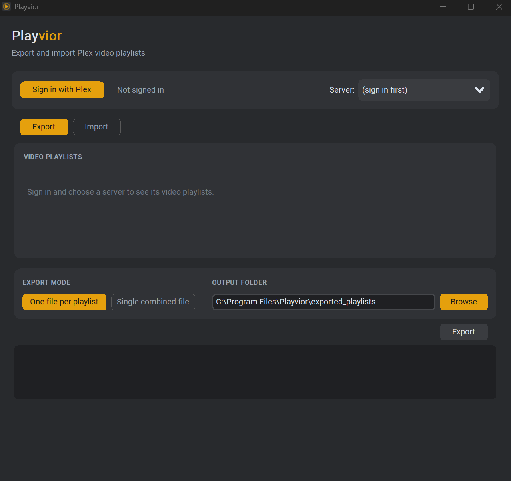
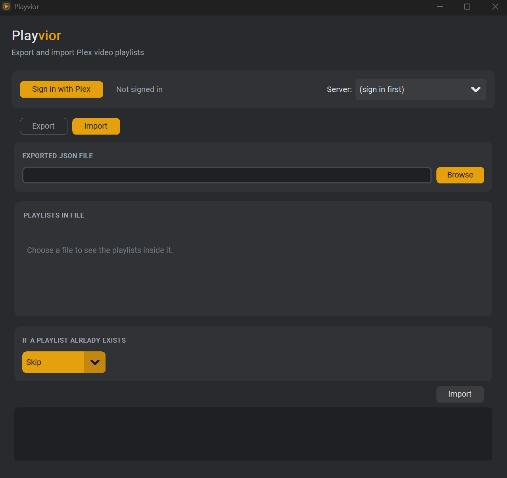

<p align="center">
  
</p>

<h1 align="center">Playvior</h1>

Playvior is a small, open-source desktop tool for **exporting and importing
video playlists in Plex Media Server** — move your playlists between
servers, back them up, or share them with someone else's Plex library.

It comes in two forms:

- A desktop **GUI** (`gui.py`) — sign in, pick a server, check off
  playlists, and export or import with a couple of clicks.
- Two standalone **command-line scripts** (`export_playlists.py` and
  `import_playlists.py`) for scripting or headless use.

Both share the same underlying logic, so they always behave identically —
the GUI is just a friendlier front end onto the same tested code.

Playvior runs on **Linux, Windows, and macOS**.

## Screenshots

<p align="center">
  
  
</p>

## Why

Plex has no built-in way to move a video playlist from one server to
another, or to back one up outside the server itself. Playvior exports a
playlist to a portable JSON file and can re-import it onto any server,
matching items by external IDs (IMDb/TMDb/TVDB) first and falling back to
title/year or show/season/episode matching when a clean ID match isn't
available.

## How matching works

Each exported item carries Plex's own GUID *and* every external GUID Plex
knows about (IMDb, TMDb, TVDB). On import, Playvior tries those first —
they survive a metadata agent change or a retitled file — and only falls
back to matching by title + year (movies) or show/season/episode
(episodes) if no ID match is found on the target server. Anything that
still can't be matched is reported, not silently dropped.

## Requirements

- Python 3.9+
- [`customtkinter`](https://github.com/TomSchimansky/CustomTkinter) — GUI only
- [`plexapi`](https://github.com/pkkid/python-plexapi) — both GUI and CLI

Install everything with:

```bash
pip install -r requirements.txt
```

or, if you only want the command-line scripts and not the GUI:

```bash
pip install plexapi
```

## Installation

### Prebuilt installer (no Python required)

Grab the installer for your OS from the
[Releases page](../../releases/latest):

- **Windows** — `PlayviorSetup-<version>.exe`
- **macOS** — `Playvior-<version>.dmg` (unsigned — see note below)
- **Linux** — `Playvior-<version>-x86_64.AppImage` (`chmod +x` it, then run it)

These are built automatically for every release; see
[packaging/README.md](packaging/README.md) for how, or to build one
yourself. The macOS and Windows builds aren't signed/notarized (that needs a
paid developer account), so macOS will call the app "unidentified developer"
and Windows SmartScreen may warn on first launch — in both cases there's a
one-time "run anyway" option to bypass it.

### From source

```bash
git clone https://github.com/animizm/Playvior.git
cd Playvior
pip install -r requirements.txt
```

## Usage

### GUI

```bash
python gui.py
```

Sign in with your Plex account (this opens a browser window for Plex's own
login/approval flow — Playvior never sees your Plex password, see
[PRIVACY.md](PRIVACY.md)), pick a server, then use the **Export** and
**Import** tabs to choose which playlists to move and where.

### Command line

**Export** every video playlist on a server to one JSON file per playlist:

```bash
python export_playlists.py --output ./exported_playlists --mode separate
```

Or as a single combined file (handy for a full backup):

```bash
python export_playlists.py --output ./exported_playlists --mode combined
```

With no `--baseurl`/`--token`, both scripts open a browser window for Plex's
PIN-based sign-in flow. If your account has more than one server, add
`--server-name "My Server"` to pick one non-interactively. To connect
directly instead (e.g. for automation), pass `--baseurl` and `--token`.

**Import** playlists from a previously exported file:

```bash
python import_playlists.py --input ./exported_playlists/playlists_export.json
```

Useful flags:

- `--select "Playlist One,Playlist Two"` — import only specific playlists
  out of a combined file (default: import everything in the file)
- `--on-conflict skip|replace|rename` — what to do if a playlist with the
  same title already exists on the target server (default: `skip`)

Run either script with `--help` for the full list of options.

## Exported file format

Exported files are plain, human-readable JSON — feel free to inspect, edit,
or version-control them. The format is documented implicitly by
`export_playlists.py`'s `export_playlist()` function; the short version is
a `schema_version`, some metadata about the source server and export time,
and a list of items, each with its title, type, external GUIDs, and (for
episodes) show/season/episode info.

## Contributing

Issues and pull requests are welcome. Please open an issue to discuss any
significant change before putting time into a PR.

## License

Playvior is licensed under the **GNU General Public License v3.0 or later**
(GPL-3.0-or-later). See [LICENSE](LICENSE) for the full text.

## Privacy

See [PRIVACY.md](PRIVACY.md) for what Playvior does (and doesn't) do with
your data.
